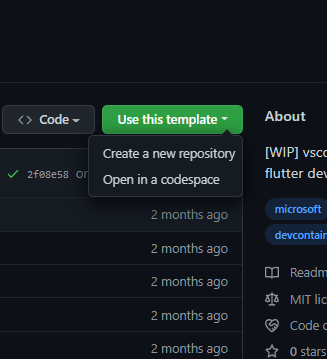
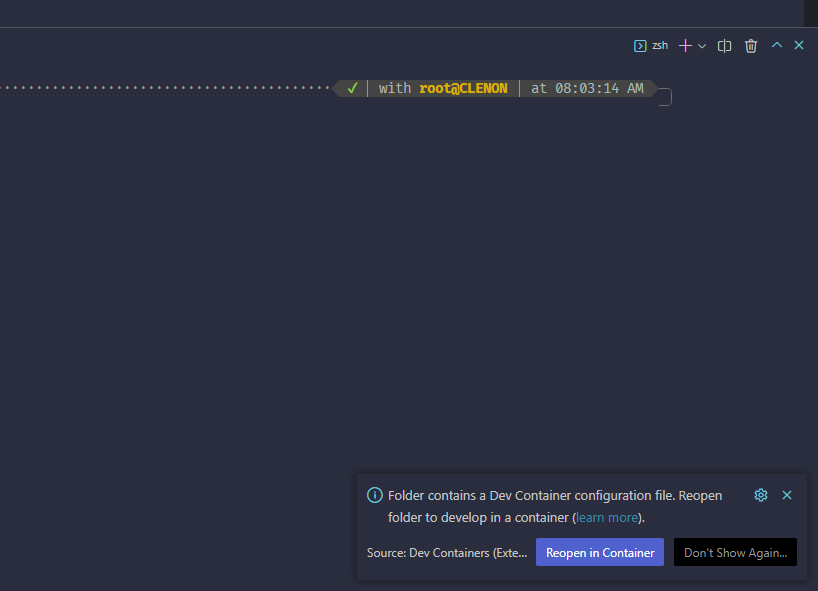

# flutter-devcontainer

    

vscode devcontainer template for flutter development.
for the people who dont want to install android studio, android sdk, flutter sdk, etc and clutter their system this is a good option.

> This template uses [devcontainer](https://code.visualstudio.com/docs/devcontainers/containers) (feature of vscode X docker) to create a container with all the tools needed to develop flutter apps.
> All the tools are installed in the container image powered by wsl2 backend linux distro so you can delete the container when the work is done without worrying about the tools installed in the container.

## How to use

this repository is a github template repository so you can use it by clicking the `use this template` button and you can either create a new repo with or open it in codespaces.

after creating the repo you can open it in vscode and it will ask you to reopen in container, click on `Reopen in Container` button and it will create a container with all the tools needed to develop flutter apps.

after the container is created you can open the terminal and run `flutter doctor` to check if everything is working fine and you can start developing flutter apps by importing your project in the container or writing a new flutter app.
